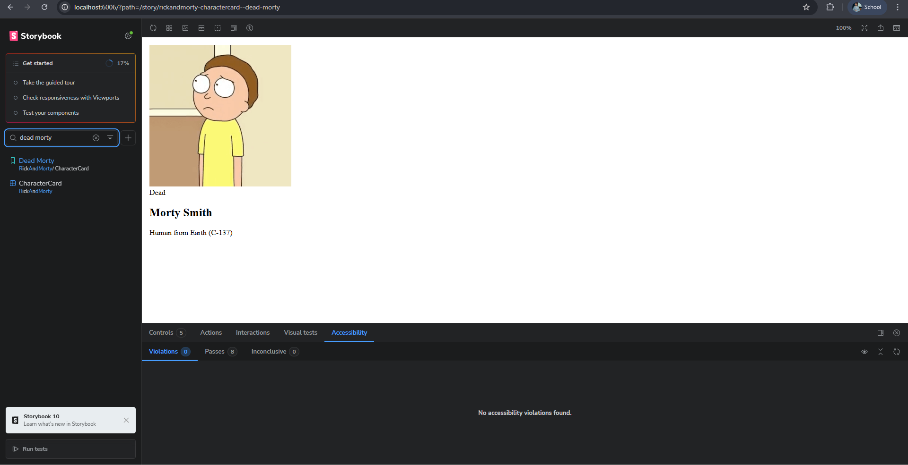

# 🌌 Rick and Morty Portal (React Edition)

A professional character explorer built with **React 18** and **Vite**. This project demonstrates modern frontend workflows, including Component-Driven Development with Storybook, automated CI/CD pipelines, and high-performance rendering.

---

## 🚀 Live Demo
Experience the Multiverse here:
👉 **[https://rick-and-morty-react-gray.vercel.app/](https://rick-and-morty-react-gray.vercel.app/)**

---

## 📸 Preview


*The interface features a custom "Neon Glassmorphism" design, responsive grid layout, and real-time character filtering.*

---

## 🛠️ Tech Stack

| Technology | Purpose |
| :--- | :--- |
| **React 18** | UI Library (Hooks & Functional Components) |
| **Vite** | Lightning-fast Build Tool & Bundler |
| **Storybook 8** | Component-Driven Development & Documentation |
| **Vitest** | Unit Testing & Logic Validation |
| **Playwright** | Browser-based Interaction Testing |
| **Vercel** | Automated Cloud Deployment |

---

## ✨ Key Features

* **🔍 Dynamic Search:** Real-time character filtering using React `useState` and optimized logic.
* **🧩 Component Isolation:** The `CharacterCard` is a standalone, reusable component built to scale.
* **📱 Fully Responsive:** A CSS Grid architecture that flows perfectly from mobile to ultra-wide monitors.
* **🎨 Professional UI:** Deep space aesthetic with accessibility-compliant neon accents.

---

## 🧪 Development & Storybook

We use **Storybook** to build and document our UI components in isolation. This ensures that every piece of the interface works correctly regardless of the API state.

To launch the component library:
```bash
npm run storybook
📦 Available Scripts
In the project directory, you can run:

🖥️ npm run dev
Starts the local development server at http://localhost:5173. Includes Hot Module Replacement (HMR).

🧪 npm run storybook
Opens the Storybook dashboard (Port 6006) to view and test individual UI components.

🏗️ npm run build
Compiles and optimizes the application for production. Output is located in the /dist folder.

🕵️ npm run lint
Analyzes the code for potential errors and enforces a clean, consistent coding style.

🧪 npm run test
Runs the test suite to verify that filtering logic and component rendering are bug-free.

👨‍🔬 Author
Dipshant Paudel https://github.com/Dishantpaudel | https://rick-and-morty-react-gray.vercel.app/

Created for the Frontend Development Assignment - 2026